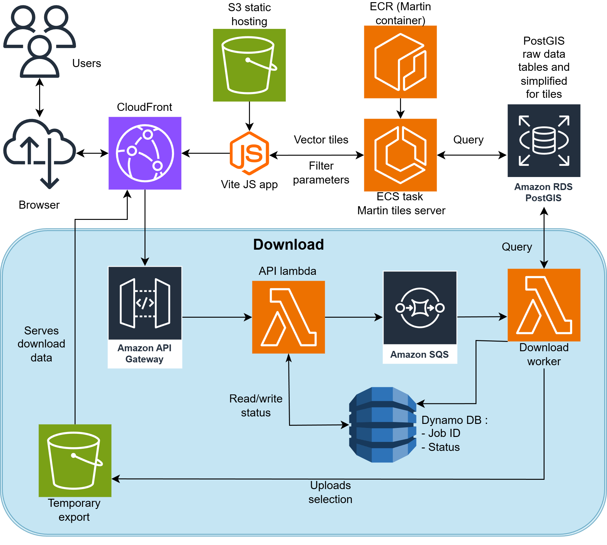

# Cascadia Landslide Viewer

A cloud-native geospatial application for exploring landslide inventories across the Cascadia region.  
Features interactive visualization, intelligent filtering, vector-tile-based rendering, and a fully serverless export pipeline capable of efficiently delivering large filtered datasets.

---

## Features

### 🗺️ Interactive 2D Visualization
- Vector tiles served via Martin (ECS Fargate)
- MapLibre-based rendering with smooth zoom transitions
- PGA contours overlay (USGS M9 scenario)
- Detail-rich popups and overlays
- Cascadia-bounded default view

### 📊 Advanced Filters

Data have been aligned for all datasets using the following fields:
- **Categorical:** Material, Movement, Confidence  (computed from original datasets)
- **Numerical:** PGA, PGV, rainfall ranges  (Using USGS M9 scenario and 30-Year (1990-2019) Annual Average of DAYMET Precipitation)
- Real-time updates reflected in tile requests  
- Filter summary panel showing active constraints

Detail of the preprocessing on the original data is available here: https://github.com/cascadiaquakes/cascadia-landslide-data

### 📤 Data Export (Serverless)
- Fully asynchronous AWS-based pipeline
- API Gateway → Lambda creates job + posts to SQS
- Worker Lambda queries PostGIS and writes results to S3
- DynamoDB stores job progress + errors
- Frontend polls job endpoint until download is ready
- Supports GeoJSON export (optionally zipped)

---

## Technology Stack

| Component | Technology | Version |
|----------|------------|---------|
| Frontend Build | Vite | Latest |
| Mapping | MapLibre GL JS | Latest |
| Tile Server | Martin | 0.14.x |
| Backend API | AWS Lambda (Python) | |
| Queue | Amazon SQS | |
| Job Tracking | DynamoDB | |
| Database | PostgreSQL + PostGIS | 16 / 3.4 |
| Deployment | AWS CDK | Latest |
| Hosting | S3 + CloudFront | |

---

## Architecture Overview



---

## Quick Start

### Prerequisites
- Node.js 18+
- Docker Desktop (for local Martin/PostGIS)
- AWS CLI + CDK (for deployment)
- Python 3.10+ (Lambda dependencies)

### Installation

**1. Clone repository**
```bash
git clone https://github.com/loicbachelot/GF-landslide-viewer.git
cd GF-landslide-viewer
```

**2. Start local Martin + PostGIS**
```bash
cd martin-server
docker-compose up
```

**3. Initialize frontend**
```bash
cd frontend
npm install
npm run dev
```

**4. Open application**
- Frontend: http://localhost:5173  
- Tiles: http://localhost:3000  

---

## Project Structure

```
GF-landslide-viewer/
├── README.md
│   # Documentation for the entire project
│
├── aws_cdk/
│   ├── app.py
│   │   # CDK entrypoint — bootstraps the AWS application and instantiates the stack
│   ├── cdk.json
│   │   # CDK configuration file (context, toolkit settings)
│   └── landslide_stack.py
│       # Main CDK stack defining all AWS resources:
│       # - VPC, RDS (PostGIS), ECS Fargate (Martin server)
│       # - Lambda functions, API Gateway
│       # - SQS queue, DynamoDB job table
│       # - CloudFront + S3 hosting for frontend
│
├── download_api/
│   ├── lambda_main.py
│   │   # Lambda handler for /download endpoint:
│   │   # Validates request, creates a job entry, pushes job to SQS
│   ├── worker_main.py
│   │   # Worker Lambda triggered by SQS:
│   │   # Executes PostGIS query, writes export file to S3, updates DynamoDB
│   ├── main.py
│   │   # Shared helpers used by both API + worker Lambdas:
│   │   # (filter validation, SQL builder, error handling)
│   └── requirements.txt
│       # Python dependencies bundled into Lambda layers or zipped packages
│
├── frontend/
│   ├── index.html
│   │   # HTML entrypoint for the Vite application
│   ├── package.json
│   │   # Frontend dependencies and scripts
│   ├── vite.config.js
│   │   # Vite build + dev server configuration
│   │
│   ├── public/
│   │   └── vite.svg
│   │       # Public assets served as-is (no bundling)
│   │
│   └── src/
│       ├── main.js
│       │   # Frontend entrypoint: initializes UI, map, filter panels
│       ├── style.css
│       │   # Global styling for the viewer
│       │
│       ├── download/
│       │   ├── api.js
│       │   │   # Frontend wrapper for POST /download and GET /download/{jobId}
│       │   └── downloadPanel.js
│       │       # UI modal for download requests + polling workflow
│       │
│       ├── filter-panel/
│       │   ├── FiltersPanel.js
│       │   │   # Creates and manages the full filter panel UI
│       │   ├── filters.js
│       │   │   # Event listeners + logic for applying filters
│       │   ├── filterState.js
│       │   │   # Central state manager for all filter values
│       │   ├── filters-panel.css
│       │   │   # Styling for the filter UI
│       │   └── landslide-filters-config.js
│       │       # Definitions of categorical + numeric filters (labels, ranges, options)
│       │
│       ├── maplibre/
│       │   ├── baselayer.js
│       │   │   # Background basemap configuration (imagery, tiles)
│       │   ├── config.js
│       │   │   # Map constants (style IDs, source IDs, bounds, colors)
│       │   ├── layers.js
│       │   │   # Render layers for landslides + PGA overlays
│       │   ├── overlay.js
│       │   │   # Additional visual overlays (labels, boxes, etc.)
│       │   ├── viewer.js
│       │   │   # Main MapLibre map initialization + interaction handlers
│       │   └── zoom.js
│       │       # Zoom helpers for syncing UI + map behavior
│       │
│       ├── summary/
│       │   └── summary.js
│       │       # Sidebar summary panel showing active filters and counts
│       │
│       └── resources/
│           ├── Crescent_Logo.png
│           ├── USNSF_Logo.png
│           ├── favicon.ico
│           └── pga_contours.json
│               # Static assets + contour GeoJSON for overlays
│
├── martin-server/
│   ├── config.yaml
│   │   # Martin configuration: database connection, tile sources, vector layers
│   └── docker-compose.yml
│       # Local development stack (PostGIS + Martin tile server)
│
└── sql/
    └── setup_db.sql
        # PostGIS schema setup sample
```

---

## API Endpoints

### **POST `/download`**
Initiate a new export job.

**Payload:**
```json
{
  "filters": {
    "materials": ["Earth", "Debris"],
    "movements": ["Flow"],
    "confidences": ["High"],
    "pga_min": 0.05,
    "pga_max": 0.5
  },
  "compress": true
}
```

**Response:**
```json
{
  "jobId": "1234-5678",
  "status": "pending"
}
```

### **GET `/download/{jobId}`**
Polls job status (DynamoDB).  
Returns download URL when ready.

---

## Database Schema

### `landslides` Table (example)

| Column | Type | Description |
|--------|------|-------------|
| id | UUID | Unique landslide identifier |
| geom | Geometry | Landslide point/polygon |
| material | TEXT | Material classification |
| movement | TEXT | Movement type |
| confidence | TEXT | Inventory confidence |
| pga | FLOAT | Peak Ground Acceleration |
| pgv | FLOAT | Peak Ground Velocity |
| rainfall | FLOAT | Annual rainfall estimate |

(Accompanying tile-optimized tables/views are defined in `sql/setup_db.sql`.)
We also store in separate tables the original data (e.g. WDNR, DOGAMI...) and use it for downloads.
---

## Development

### Frontend Development
```bash
cd frontend
npm run dev
```

### CDK Deployment
```bash
cd aws_cdk
cdk deploy
```

### Worker Lambda Testing
```bash
python download_api/worker_main.py
```

---

## Deployment

### Production Frontend Build
```bash
cd frontend
npm run build
```
Deploy `dist/` to S3 + CloudFront.

### Backend Deployment
Handled entirely by CDK (API Gateway, Lambdas, SQS, DynamoDB, ECS, RDS).

---

## Troubleshooting

### Frontend not loading
- Hard refresh: `Ctrl + Shift + R`
- Check console errors
- Verify tile server reachable

### Tiles missing
- Ensure Martin is running locally
- Check PostGIS connection string in `config.yaml`

### Downloads failing
- Check Lambda logs (API + worker)
- Verify SQS queue not stalled
- Check DynamoDB job entry for error messages

---

## Performance

- Vector tiles minimize data transfer  
- Simplified geometry tables optimized for rendering  
- Serverless download pipeline prevents API timeouts  
- CloudFront caching improves global latency  

---

## Credits

**Developed by:** CRESCENT Dev Team (Loïc, William and Amanda) based on the work of Prasaya Acharya
**Funded by:** U.S. National Science Foundation  
**Landslide Data:**  
California Geological Survey (CGS)  
Oregon Department of Geology and Mineral Industries (DOGAMI)  
Washington Geological Survey (WGS)  
British Columbia Geological Survey (Canada)

---

## License

Released under the **BSD 3-Clause License**.

---

## Support

For technical questions or issues:  
- Open an issue on GitHub  
- Contact the CRESCENT development team  
